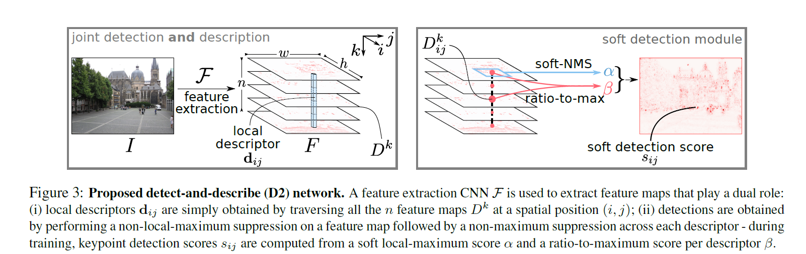

D2-Net-based SLAM
======
In 2019, I did a project related to SLAM, which used D2Net to obtain keypoints
and descriptors in replacement of ORB. In this post, I will give a detailed introduction
about this project.

What is SLAM?
-----
The full name of SLAM is Simultaneous localization and mapping. As the name shows, it is
a method that constructs a map of an unknown environment while keeping track of a robot's location at the same time.

What is keypoints and descriptors?
-----
A keypoint in an image is the position that stands out.
The corresponding descriptor is a vector describes the gradient information of that position.

What is ORB feature?
------
ORB is an alternative to SIFT and SURF. Its full name is Oriented FAST and rotated BRIEF.
It is a fast robust local feature detector.

How does D2Net work? [1]
------
D2-Net is a trainable CNN for joint description and detection of local features.
The following figure shows the proposed framework.

Training loss:

Training data:

References
=====
1. Dusmanu, Mihai & Rocco, Ignacio & Pajdla, Tomas & Pollefeys, Marc & Sivic, Josef & Torii, Akihiko & Sattler, Torsten. (2019). D2-Net: A Trainable CNN for Joint Description and Detection of Local Features. 8084-8093. 10.1109/CVPR.2019.00828. 
